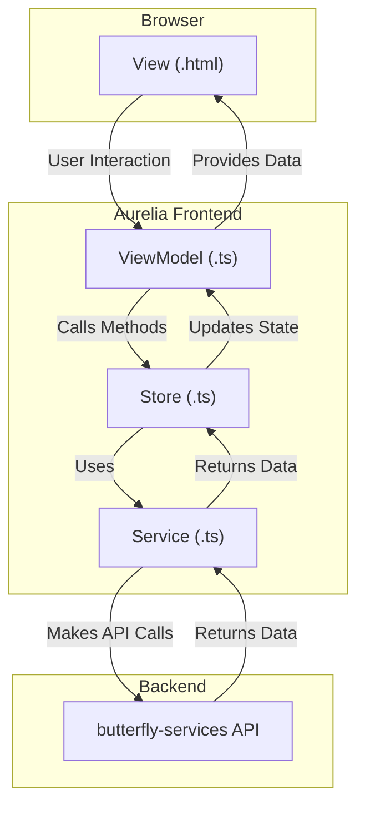

# Frontend Architecture Guide

## Overview

The batch-take-profit frontend is built using the Aurelia framework with TypeScript, implementing a clean separation of concerns through a modern component-store-service pattern. This architecture ensures maintainability, testability, and scalability while handling the complexities of cryptocurrency exchange integrations.

## Core Architectural Patterns

The application follows a clear data flow, separating responsibilities into distinct layers.



### 1. View/ViewModel Pattern

**Views (.html)**
- The presentation layer, built with standard HTML and Aurelia's templating syntax.
- Contains minimal logic, primarily focused on displaying data and delegating user events to the ViewModel.
- Binds to ViewModel properties and methods.

**ViewModels (.ts)**
- The UI controller that manages the state and behavior of a component.
- Injects and coordinates with Stores to get data and trigger business logic.
- Exposes observable properties that the View binds to.

*Example from `exchange-component.ts`:*
```typescript
@inject(AssetExchangeApiServiceToken, OrdersStoreToken, AssetsStoreToken)
export class ExchangeComponent {
  @bindable assets: IAssetEx[] = [];

  constructor(
    private readonly assetExchangeService: IAssetExchangeService,
    private readonly ordersStore: IOrdersStore,
    private readonly assetsStore: IAssetsStore
  ) {}

  async createOrders(): Promise<void> {
    const selectedAssets = this.assets.filter(asset => asset.selected);
    for (const asset of selectedAssets) {
      // Complex logic is handled by the service, initiated from the component
      await this.assetExchangeService.createSellOrder(asset, this.assetsStore.getQuoteCoin(asset), asset.limit);
    }
    // After action, update state via the store
    this.ordersStore.fetchOpenedOrders();
  }
}
```

### 2. Store Pattern

Stores act as centralized state managers for different domains of the application. They hold the application's state and contain the logic to manage and update it.

**Key Stores:**
- **`AssetsStore`**: Manages the state of cryptocurrency assets, including their balances and current prices.
- **`OrdersStore`**: Manages the state of open and closed orders.

*Example from `orders-store.ts`:*
```typescript
@inject(AssetExchangeApiServiceToken)
export class OrdersStore implements IOrdersStore {
  @observable openedOrders: IOpenedOrderListItemView[] | null = null;
  @observable fetchingOpenedOrders = false;

  constructor(private readonly assetExchangeService: IAssetExchangeService) {}

  async fetchOpenedOrders(): Promise<void> {
    this.fetchingOpenedOrders = true;
    try {
      const orders = await this.assetExchangeService.getOpenOrders();
      // Sort and update the observable state property
      this.openedOrders = orders.sort((a, b) => b.createdAt.localeCompare(a.createdAt));
    } catch (error) {
      this.logger.error('Failed to fetch open orders:', error);
      this.openedOrders = [];
    } finally {
      this.fetchingOpenedOrders = false;
    }
  }
}
```

### 3. Service Layer

Services are responsible for encapsulating external interactions, primarily communication with the `butterfly-services` backend. They are stateless and provide a clear API for data fetching and submission.

**Key Services:**
- **`AssetExchangeApiService`**: The primary interface to the backend, providing typed methods for all API operations (e.g., fetching prices, creating orders).
- **`RequestQueueService`**: Serializes all outgoing API requests to ensure they are processed in order, which is critical for nonce management.
- **`EnvService`**: Loads and provides access to the application's configuration (`config.json` and `config.local.json`).

## Key Technical Decisions

### Error Handling Strategy

**Nonce Management**: Nonce-related API errors are primarily solved by a server-side configuration on the Kraken API key ("Custom Nonce Window"). The frontend's `RequestQueueService` complements this by serializing requests, ensuring predictable execution order.
**User Feedback**: User-facing alerts notify users of the success or failure of operations.
**Graceful Degradation**: The application is designed to remain functional even if some API calls fail, for example, by showing cached data or allowing manual refreshes.

### State Management

**Reactive Updates**: Stores use Aurelia's `@observable` properties. When these properties are updated (e.g., with new data from the API), the UI (Views) bound to them automatically re-renders.
**Caching Strategy**: Services may implement caching (e.g., for prices) to improve performance and reduce redundant API calls.
**Optimistic Updates**: For some operations, the UI could be updated immediately, assuming success, and then reverted if the API call fails. (Currently not implemented).

## Component Architecture

### `ExchangeComponent`
The main trading interface where users can configure and execute batch sell orders.

### `OrdersDisplay`
A component that shows lists of open and closed orders, with the ability to cancel open orders.

### `table-gryd`
A reusable wrapper component that provides a consistent look and feel for data tables, including loading and empty states.

## Integration Patterns

### Fluent UI Integration

**`FluentUIAdapter` Pattern**
The project uses a custom `FluentUIAdapter` (in `src/stores/fluent-ui-adapter.ts`) to enable seamless two-way data binding between Aurelia and Fluent UI Web Components, which is not supported out-of-the-box.

**Shadow DOM Styling**
Fluent UI components use Shadow DOM, which isolates their internal styles. To customize them:
- **Use CSS Custom Properties:** The primary way to style component internals is by overriding their CSS variables (e.g., `style="--accent-fill-rest: #4a7a49;"`).
- **Use `::part()` selector:** For more direct styling, target a component's internal part, as done in `fluent-dialog-overrides.css`.
- **TailwindCSS:** Utility classes are effective for layout and styling of the containers that *hold* Fluent components, but not for the components' internals.

### Backend Communication

All backend communication is funneled through the `RequestQueueService` to ensure serialized execution. See `INTEGRATION.md` for a detailed explanation of why this is critical.

### Dependency Injection

Aurelia's built-in DI container manages all dependencies, making components and services easy to test and maintain.

*Example from `exchange-component.ts`:*
```typescript
@inject(
  AssetExchangeApiServiceToken,
  OrdersStoreToken,
  RequestQueueServiceToken,
  AssetsStoreToken,
  IDialogService
)
export class ExchangeComponent {
  constructor(
    private readonly assetExchangeService: IAssetExchangeService,
    private readonly ordersStore: IOrdersStore,
    private readonly queueService: IRequestQueueService,
    private readonly assetsStore: IAssetsStore,
    private readonly dialogService: IDialogService
  ) {}
}
```

## TypeScript Coding Conventions

### Interface Naming
All TypeScript interfaces must be prefixed with "I" to follow industry best practices and improve code clarity.

```typescript
// ✅ Correct
export interface IOpenedOrderListItem {
  orderId: string;
  // ...
}

// ❌ Incorrect
export interface OpenedOrderListItem {
  orderId: string;
  // ...
}
```

## Future Architecture Considerations

### Scalability
- **Component Lazy Loading**: For larger applications, load components only when they are needed.
- **State Management**: For more complex state interactions, consider a more robust state management library or pattern.

### Extensibility
- **Plugin Architecture**: Design services to be extensible for supporting additional exchanges in the future.
- **Modular Components**: Keep components focused on a single responsibility to make them easier to reuse and replace.
